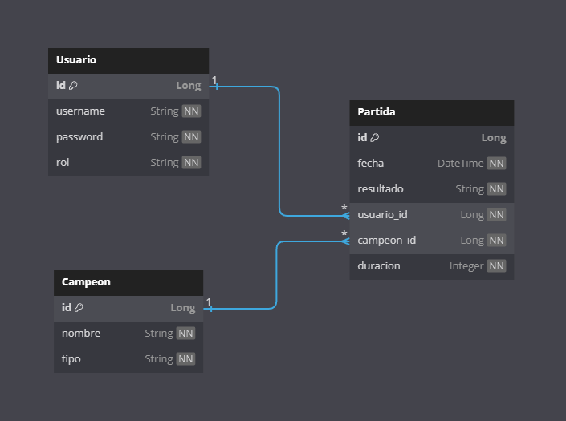

# Nombre: LolApiRest

## Descripción

Esta API gestiona un sistema para el seguimiento de partidas de un juego competitivo,
enfocándose en los usuarios, los campeones utilizados y los resultados de las partidas.
Permite a los desarrolladores integrar funcionalidades relacionadas con el manejo de datos de usuarios, campeones y estadísticas de partidas.

---

## Justificación

La idea de hacer esta API surge porque en muchos juegos competitivos hay un montón de información interesante que los jugadores pueden querer analizar:
desde con qué campeones juegan mejor, hasta cómo han mejorado con el tiempo o qué tan bien les va contra ciertos tipos de campeones.

---

## Estructura de las entidades

Se trabajará con las siguientes tres entidades:

1. **Usuario**: Esta tabla almacena información sobre los usuarios del sistema
    - `id` (Long): Identificador único del usuario.
    - `username` (String): Nombre del usuario (debe ser único).
    - `password` (String): Contraseña del usuario (debe estar hasheada).
    - `rol` (String): Rol del usuario, que puede ser `USER` o `ADMIN`.

2. **Campeon**: Esta tabla contiene información sobre los campeones disponibles en el sistema.
    - `id` (Long): Identificador único del campeón.
    - `nombre` (String): Nombre del campeón.
    - `tipo` (String): Tipo de campeón (asesino, mago, bruiser...).

3. **Partida**: Esta tabla registra las partidas jugadas y sus estadisticas, vinculando a un usuario con un campeón utilizado en una partida específica.
    - `id` (Long): Identificador único de la partida.
    - `fecha` (DateTime): Fecha y hora en que se jugó la partida.
    - `resultado` (String): Resultado de la partida (victoria, derrota).
    - `usuario_id` (Long): Identificador del usuario que participó en la partida (relación con la entidad **Usuario**).
    - `campeon_id` (Long): Identificador del campeón usado en la partida (relación con la entidad **Campeón**).
    - `duracion` (Integer): Duración de la partida en minutos.

---

## Diagrama Entidad-Relación

---

# Endpoints de la API

## **Endpoints de Usuario**

### Registro y autenticación
- `POST /usuarios/registro`: Crea un nuevo usuario.
    - Logica de negocio:
      - verificar que el nombre de usuario no esté ya en uso
   - Excepciones:
      - **400 Bad Request**: Si los datos del usuario son inválidos (el username o la password va vacio o es null).
      - **409 Conflict**: Si el `username` ya está registrado.
      - **500 Internal Server Error**: Si hay un error inesperado al crear el usuario.

- `POST /usuarios/login`: Autentica un usuario y genera un token de acceso.
    - Logica de negocio:
      - verificar que las credenciales coincidan con un usuario existente
   - Excepciones:
      - **400 Bad Request**: Si faltan los parámetros `username` o `password` en la solicitud.
      - **401 Unauthorized**: Si las credenciales del usuario son incorrectas.
      - **500 Internal Server Error**: Si ocurre un error al autenticar al usuario.

### Gestión de usuarios
- `GET /usuarios`: Obtiene la lista de usuarios (solo para admins).
    - Logica de negocio:
      - solo disponible para admins
  - Excepciones:
     - **403 Forbidden**: Si el usuario no tiene permisos de administrador para ver la lista de usuarios.
     - **500 Internal Server Error**: Si ocurre un error inesperado al obtener la lista de usuarios.

- `GET /usuarios/{id}`: Obtiene los detalles de un usuario por su ID.
    - Logica de negocio:
        - solo el propio usuario o los admin pueden acceder a estos detalles
   - Excepciones:
      - **404 Not Found**: Si no se encuentra el usuario con el ID proporcionado.
      - **403 Forbidden**: Si el usuario no tiene permisos para obtener este usuario (no es el mismo usuario o no es admin).
      - **500 Internal Server Error**: Si hay un problema al obtener la información del usuario.
     

- `PUT /usuarios/{id}`: Actualiza información de un usuario (ej.: username).
    - Logica de negocio:
        - solo los admin pueden actualizar usuarios
   - Excepciones:
     - **400 Bad Request**: Si los datos proporcionados son incorrectos o están mal formateados.
     - **404 Not Found**: Si no se encuentra el usuario con el ID proporcionado.
     - **403 Forbidden**: Si el usuario no tiene permisos para modificar este usuario (o no es admin).
     - **500 Internal Server Error**: Si ocurre un error al actualizar el usuario.
     

- `DELETE /usuarios/{id}`:Elimina un usuario (solo admins).
    - Logica de negocio:
        - solo el disponible para admins
  - Excepciones:
    - **404 Not Found**: Si no se encuentra el usuario con el ID proporcionado.
    - **403 Forbidden**: Si el usuario no tiene permisos para eliminar este usuario.
    - **500 Internal Server Error**: Si ocurre un error al eliminar el usuario.
---

## **Endpoints de Campeón**

### Gestión de campeones
- `POST /campeones`: Agrega un nuevo campeón (solo admins).
    - Logica de negocio:
        - solo el disponible para admins
  - Excepciones:
    - **400 Bad Request**: Si los datos del campeón son incorrectos o faltan campos necesarios (por ejemplo, `nombre` o `tipo`).
    - **403 Forbidden**: Si el usuario no tiene permisos para crear el campeón.
    - **500 Internal Server Error**: Si hay un error inesperado al crear el campeón.
    

- `GET /campeones`: Lista todos los campeones disponibles.
  - Excepciones:
    - **500 Internal Server Error**: Si ocurre un error al obtener la lista de campeones
    

- `GET /campeones/{id}`: Obtiene detalles de un campeón específico por su ID.
  - Excepciones:
    - **404 Not Found**: Si no se encuentra el campeón con el ID proporcionado.
    - **500 Internal Server Error**: Si ocurre un error al obtener el campeón.

- `PUT /campeones/{id}`: Actualiza los detalles de un campeón (solo admins).
    - Logica de negocio:
        - solo el disponible para admins
  - Excepciones:
    - **400 Bad Request**: Si los datos proporcionados son incorrectos o están mal formateados.
    - **403 Forbidden**: Si el usuario no tiene permisos para actualizar el campeón.
    - **404 Not Found**: Si no se encuentra el campeón con el ID proporcionado.
    - **500 Internal Server Error**: Si ocurre un error al actualizar el campeón.

- `DELETE /campeones/{id}`: Elimina un campeón (solo admins).
    - Logica de negocio:
        - solo el disponible para admins
   - Excepciones:
      - **404 Not Found**: Si no se encuentra el campeón con el ID proporcionado.
      - **403 Forbidden**: Si el usuario no tiene permisos para eliminar el campeón.
      - **500 Internal Server Error**: Si ocurre un error al eliminar el campeón.

---

## **Endpoints de Partida**

### Gestión de partidas
- `POST /partidas`: Registra una nueva partida asociada a un usuario y un campeón.
    - Logica de negocio:
        - validar los datos, solo el propio usuario o los admin pueden registrar partidas
   - Excepciones:
      - **400 Bad Request**: Si los datos de la partida son incorrectos o faltan parámetros necesarios (por ejemplo, `usuario_id` o `campeon_id`).
      - **404 Not Found**: Si no se encuentra el usuario o el campeón con los IDs proporcionados.
      - **500 Internal Server Error**: Si ocurre un error al registrar la partida.
     

- `GET /partidas`: Lista todas las partidas registradas del usuario o todas si es admin.
    - Logica de nogocio:
        - si el usuario que hace la peticion es admin obtenie todas las partidas, si no lo es obtiene sus propias partidas
   - Excepciones:
      - **500 Internal Server Error**: Si ocurre un error al obtener la lista de partidas.
     

- `GET /partidas/{id}`: Obtiene los detalles de una partida específica.
   - Excepciones:
      - **404 Not Found**: Si no se encuentra la partida con el ID proporcionado.
      - **500 Internal Server Error**: Si ocurre un error al obtener los detalles de la partida.

- `PUT /partidas/{id}`: Actualiza la información de una partida (ej.: resultado, duración).
   - Excepciones:
      - **400 Bad Request**: Si los datos proporcionados para actualizar la partida son incorrectos.
      - **404 Not Found**: Si no se encuentra la partida con el ID proporcionado.
      - **500 Internal Server Error**: Si ocurre un error al actualizar la partida.
     

- `DELETE /partidas/{id}`: Elimina una partida registrada.
    - Logica de negocio:
        - solo el propio usuario o los admin pueden elimir partidas
   - Excepciones:
      - **404 Not Found**: Si no se encuentra la partida con el ID proporcionado.
      - **500 Internal Server Error**: Si ocurre un error al eliminar la partida.
